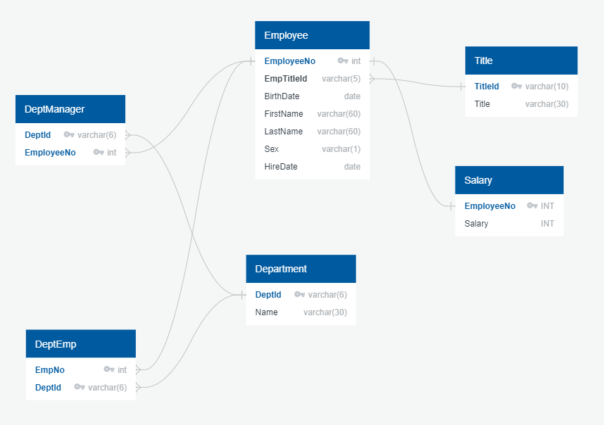

# SQL Challenge Homework Assignment

## Introduction
As a junior data engineer for Pewlett Hackard, I have been tasked to provide data analysis/engineering support for a project to research corporate employee data from the 1980's and 90's.  

## Deliverables
- Profile employee data provided in CSV files. Each file will be imported into a table.
- Develop ERD diagram describing relationships discovered during data profiling stage.
    - Utilize the tool [http://www.quickdatabasediagrams.com](http://www.quickdatabasediagrams.com) to create an ERD diagram describing the table relationships.  
    - The following image will bew stored in EmployeeSQL directory in GitHub repository.  The name of the file is EmployeeERD.png.
        - 
- From the ERD diagram create the DDL commands that will be utilized to create the tables in Postgres database.  Appropriate primmary and foreign keys should be included that enforce relationships described in ERD diagram.
    - DDL script saved in the EmployeeSQL directory and named **EmployeeSchemaDDL.sql**
- Run DDL script in Postgres to create the tables.
- Import the CSV data into corresponding Postgres tables.  Tables referenced by foreign keys should be loaded first, so a constraint violation is not triggered.

## Analysis 
With the nely populated tables write SQL queries to answer the following questions:

1. List the following details of each employee: employee number, last name, first name, sex, and salary.

2. List first name, last name, and hire date for employees who were hired in 1986.

3. List the manager of each department with the following information: department number, department name, the manager's employee number, last name, first name.

4. List the department of each employee with the following information: employee number, last name, first name, and department name.

5. List first name, last name, and sex for employees whose first name is "Hercules" and last names begin with "B."

6. List all employees in the Sales department, including their employee number, last name, first name, and department name.

7. List all employees in the Sales and Development departments, including their employee number, last name, first name, and department name.

8. In descending order, list the frequency count of employee last names, i.e., how many employees share each last name.

The SQL query code should be saved in the EmployeeSQL folder and file named **EmployeeQueriessql**.

## Optional
Utilize SQL Alchemy within a Jupyter notebook to import employee salary information from Postgres into a Pandas dataframe.  Analyze data for validity.  There is speculation that the salary data is suspect.  The jupyter notebook will be saved in the EmployeeSQL folder and named **EmployeeJobAnalysis.ipynb**.  The analysis results will be included in the jupyter notebook.
